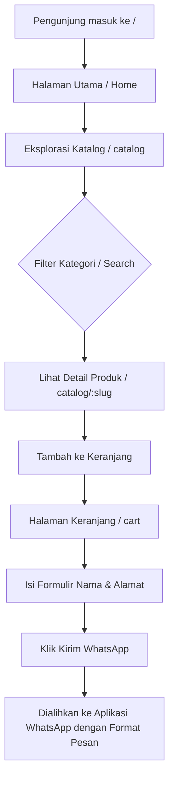

# Project Specification: Website Katalog Produk PS MAS

**Tanggal**: 2026-06-30  
**Status**: Disetujui  
**Bahasa**: Bahasa Indonesia  
**Teknologi Utama**: React 19, Vite, TypeScript, Tailwind CSS v4, Zustand, React Router DOM, Framer Motion

---

## Daftar Isi
1. [Executive Summary](#1-executive-summary)
2. [Business Analysis](#2-business-analysis)
3. [User Personas](#3-user-personas)
4. [User Journey](#4-user-journey)
5. [Website Workflow](#5-website-workflow)
6. [Information Architecture](#6-information-architecture)
7. [Sitemap](#7-sitemap)
8. [Product Requirement Document (PRD)](#8-product-requirement-document-prd)
9. [Functional & Non-functional Requirements](#9-functional--non-functional-requirements)
10. [Feature Prioritization (MoSCoW)](#10-feature-prioritization-moscow)
11. [UI Strategy](#11-ui-strategy)
12. [UX Strategy](#12-ux-strategy)
13. [Complete Design System](#13-complete-design-system)
14. [Home Page Structure](#14-home-page-structure)
15. [About Page](#15-about-page)
16. [Catalog Page](#16-catalog-page)
17. [Product Detail Page](#17-product-detail-page)
18. [Shopping Cart Page](#18-shopping-cart-page)
19. [Contact Page](#19-contact-page)
20. [WhatsApp Ordering Flow](#20-whatsapp-ordering-flow)
21. [Product Data Model (TypeScript)](#21-product-data-model-typescript)
22. [Folder Structure](#22-folder-structure)
23. [Component Architecture](#23-component-architecture)
24. [State Management Strategy](#24-state-management-strategy)
25. [SEO Strategy](#25-seo-strategy)
26. [Accessibility Strategy](#26-accessibility-strategy)
27. [Performance Strategy](#27-performance-strategy)
28. [Deployment Strategy](#28-deployment-strategy)
29. [Scalability Roadmap](#29-scalability-roadmap)
30. [Development Roadmap](#30-development-roadmap)

---

## 1. Executive Summary
Website Katalog Produk **PS MAS** dirancang sebagai media representasi digital yang profesional untuk produk abon (sapi, ayam, serundeng, dll.) khas PS MAS. Fokus utama dari situs web ini adalah membangun kepercayaan pelanggan, menyajikan detail produk dengan estetika tinggi, dan mempermudah konversi ke pemesanan manual via WhatsApp tanpa kerumitan sistem e-commerce penuh.

---

## 2. Business Analysis
*   **Masalah Utama**: Pelanggan sering menanyakan katalog produk, daftar harga, dan ketersediaan stok berulang kali via chat WhatsApp, yang menghabiskan waktu operasional admin.
*   **Solusi**: Website katalog informatif yang memuat seluruh varian produk, detail berat, deskripsi bahan, harga, dan status stok. Pelanggan dapat memilih produk secara mandiri sebelum diarahkan langsung ke WhatsApp dengan draf pesanan yang sudah terisi otomatis.

### Analisis SWOT Singkat:
*   **Strengths**: Produk abon yang sudah dikenal, kualitas rasa premium, varian beragam.
*   **Weaknesses**: Belum memiliki media katalog online terpusat selain media sosial.
*   **Opportunities**: Menjangkau pasar oleh-oleh nasional dan mempermudah reseller melakukan pemesanan partai besar.
*   **Threats**: Kompetisi dari brand abon lain yang sudah memiliki platform toko online sendiri.

---

## 3. User Personas
### Persona A: Ibu Shanti (42 tahun, Ibu Rumah Tangga & Pembeli Oleh-oleh)
*   **Tujuan**: Membeli abon sapi berkualitas tinggi untuk stok lauk keluarga dan oleh-oleh kerabat.
*   **Perilaku**: Menggunakan smartphone, menyukai navigasi cepat, ingin melihat foto produk yang bersih dan higienis, serta ingin langsung memesan tanpa registrasi akun yang ribet.
*   **Pain Point**: Malas membuat akun belanja, takut penipuan online, ingin kepastian respon cepat via WhatsApp.

### Persona B: Budi (29 tahun, Pemilik Toko Oleh-oleh / Reseller)
*   **Tujuan**: Memesan abon PS MAS dalam jumlah banyak untuk dijual kembali.
*   **Perilaku**: Memeriksa varian ukuran kemasan/berat (gramasi) dan harga grosir, membutuhkan informasi bahan baku/sertifikasi halal secara cepat.
*   **Pain Point**: Kesulitan melihat katalog varian lengkap jika hanya dikirim via file PDF atau chat WhatsApp manual.

---

## 4. User Journey
Berikut adalah langkah pengguna dari awal berkunjung hingga konversi:
1.  **Landing (Home)**: Menemukan keunggulan brand PS MAS dan produk terlaris.
2.  **Browsing (Catalog)**: Memfilter berdasarkan kategori (Sapi, Ayam, Serundeng) dan mencari nama produk tertentu.
3.  **Viewing (Product Detail)**: Membaca deskripsi produk, bahan baku, berat kemasan, melihat galeri foto produk, dan memeriksa ketersediaan stok.
4.  **Selecting (Cart)**: Menambahkan produk ke keranjang belanja, menyesuaikan kuantitas dan varian ukuran.
5.  **Converting (WhatsApp Checkout)**: Menekan tombol "Pesan Sekarang", mengisi nama & alamat, lalu diarahkan ke WhatsApp dengan pesan terformat otomatis.

---

## 5. Website Workflow


---

## 6. Information Architecture
Navigasi website dirancang flat (maksimal 2 tingkat kedalaman) untuk memastikan akses cepat dari perangkat mobile:
*   **Level 1**: Header/Navbar (Home, Tentang Kami, Katalog, Kontak, Icon Keranjang).
*   **Level 2 (Katalog)**: Filter Kategori & List Card Produk.
*   **Level 3 (Detail Produk)**: Deskripsi Lengkap, Komposisi, Galeri Foto, dan Produk Terkait.
*   **Level 2 (Keranjang)**: Ringkasan belanjaan, input data pembeli (Nama & Alamat), dan tombol kirim WhatsApp.

---

## 7. Sitemap
*   `/` (Home Page)
*   `/about` (Tentang Brand, Sejarah PS MAS, Kualitas Bahan)
*   `/catalog` (Semua Produk + Filter Kategori)
*   `/catalog/:slug` (Detail Produk Spesifik)
*   `/cart` (Keranjang Belanja + Form Checkout WA)
*   `/contact` (Detail Lokasi Toko, Map, Form Kontak)

---

## 8. Product Requirement Document (PRD)
*   **Nama Proyek**: Katalog Digital PS MAS
*   **Platform**: Web (Mobile-First responsive, dioptimalkan untuk Chrome & Safari mobile)
*   **Target MVP**: Katalog interaktif yang menampilkan 30-40 produk dengan cart persisten (LocalStorage) yang bisa terintegrasi ke WhatsApp API.

---

## 9. Functional & Non-functional Requirements
### Functional:
1.  Pencarian produk secara real-time.
2.  Filter produk berdasarkan kategori utama.
3.  Penyimpanan keranjang belanja lokal tanpa login menggunakan Zustand + LocalStorage.
4.  Formulir identitas pembeli sebelum checkout.
5.  Pembuat tautan WhatsApp otomatis dengan isi pesanan terformat.

### Non-functional:
1.  **Performance**: Score Google PageSpeed Insights >90 untuk Mobile dan Desktop.
2.  **Accessibility**: Memenuhi standar WCAG 2.1 Level AA (kontras warna rasio 4.5:1, dukungan keyboard navigation, label aria untuk tombol ikon).
3.  **SEO**: Metadata statis per rute, OpenGraph tags, sitemap.xml, dan JSON-LD Structured Data untuk produk.

---

## 10. Feature Prioritization (MoSCoW)
*   **Must Have**: Katalog produk, Detail produk, Keranjang Belanja, Integrasi Pesan WhatsApp, Responsive Layout.
*   **Should Have**: Pencarian produk, filter kategori, produk terkait (related products), LocalStorage Cart Persistence.
*   **Could Have**: FAQ interaktif, Peta Google Maps tersemat di halaman kontak.
*   **Won't Have**: Sistem pembayaran payment gateway, kalkulator ongkir otomatis (ekspedisi), login user, panel admin/CMS (semua dikelola di file program).

---

## 11. UI Strategy
Strategi visual untuk PS MAS adalah menghadirkan kesan **modern, bersih, hangat (warm), dan berfokus pada produk makanan**. Kami menghindari gaya antarmuka *marketplace* yang padat dan membingungkan, serta fokus pada kesederhanaan *brand catalog* premium.

### Prinsip Desain UI:
*   **Branded Colors**: Menggunakan kombinasi warna Merah Brand dan Kuning Soft agar selaras dengan logo PS MAS.
*   **Clean Layout**: Tidak ada banner iklan berkedip atau elemen navigasi yang terlalu padat.
*   **Visual Anti-Patterns to Avoid**:
    *   *No Marketplace UI*: Menghindari tata letak yang terlalu penuh.
    *   *No Dark Theme & Heavy Gradients*: Desain sepenuhnya menggunakan tema terang bernuansa kuning pastel lembut untuk menjaga kehangatan visual produk makanan.
    *   *No Glassmorphism*: Menggunakan batas (*border*) solid tipis dan bayangan lembut (*soft shadows*) untuk pemisahan kedalaman visual.

---

## 12. UX Strategy
*   **Mobile-First Approach**: Semua tata letak dirancang untuk layar ponsel terlebih dahulu, karena mayoritas pembeli mengakses melalui perangkat seluler.
*   **Frictionless Conversion**: Tombol checkout di halaman Keranjang Belanja langsung memicu pengalihan ke WhatsApp. Pengguna hanya perlu mengisikan Nama & Alamat pengiriman.
*   **Zustand LocalStorage Cart Persistence**: Keranjang belanja tersimpan secara otomatis di memori browser. Jika pengguna menutup tab browser secara tidak sengaja dan membukanya kembali, item belanjaan mereka tidak akan hilang.
*   **Clear Call to Action (CTA)**: Setiap kartu produk memiliki tombol CTA "Tambah" yang jelas. Tombol mengambang WhatsApp selalu tersedia di sudut kanan bawah layar pada halaman selain halaman Keranjang untuk mempermudah komunikasi instan.

---

## 13. Complete Design System
Sistem desain didasarkan pada skala 8px untuk menjamin konsistensi jarak (*spacing*).

### A. Palet Warna (Color Palette)
*   `primary`: `#C62828` (Merah Crimson/Chili tebal untuk Header Navbar, Tombol CTA Utama, Harga Produk)
*   `primary-hover`: `#B71C1C` (Efek hover tombol utama merah)
*   `accent`: `#FBC02D` (Kuning Emas Solid untuk Badge Promo, Rating Bintang, Highlight kecil)
*   `background`: `#FFFDEB` (Krem gading hangat untuk latar belakang utama halaman agar tulisan kontras)
*   `surface`: `#FFFFFF` (Latar belakang Card produk, modal detail, dan area konten utama)
*   `surface-accent`: `#FFF5CC` (Latar belakang section khusus seperti banner promo atau footer)
*   `text`: `#1F1F1F` (Hitam arang kontras tinggi untuk teks utama agar mudah dibaca)
*   `text-muted`: `#666666` (Teks pelengkap, sub-heading, caption)
*   `border`: `#F5ECD7` (Border tipis bernuansa kuning hangat untuk pembatas kartu produk)

### B. Tipografi (Typography)
*   **Heading Font**: `Playfair Display` (Serif klasik, sangat anggun dan berkelas untuk mencerminkan warisan cita rasa tradisional).
*   **Body Font**: `Plus Jakarta Sans` (Sans-serif modern yang sangat bersih dan mudah dibaca pada layar perangkat mobile).
*   **Skala Tipografi**:
    *   `H1` (Hero Title): `32px` (Mobile) / `48px` (Desktop) - Bold (700)
    *   `H2` (Section Title): `24px` (Mobile) / `32px` (Desktop) - Semibold (600)
    *   `H3` (Component Title): `20px` - Semibold (600)
    *   `H4` (Product Title): `18px` - Medium (500)
    *   `Body`: `16px` - Regular (400)
    *   `Small`: `14px` - Regular (400)
    *   `Caption`: `12px` - Medium (500) / Regular (400)

### C. Spacing & Radius System
*   **Spacing Scale**: Kelipatan 8px (`8px`, `16px`, `24px`, `32px`, `48px`, `64px`).
*   **Border Radius**: `16px` (untuk kartu produk & tombol) dan `24px` (untuk container section utama).
*   **Shadows**: `shadow-sm` (bayangan dasar halus) dan `shadow-md` (untuk elemen interaktif seperti kartu produk saat di-hover).

---

## 14. Home Page Structure
*   **Header / Navbar**: Logo PS MAS di kiri (menggunakan placeholder visual Unsplash), menu navigasi lengkap (Home, Katalog, Tentang Kami, Kontak), dan ikon Keranjang Belanja dengan badge jumlah item di kanan.
*   **Hero Section**:
    *   *Kiri*: Headline besar bernuansa klasik ("Kehangatan Cita Rasa Abon Asli PS MAS"), deskripsi singkat produk premium tanpa pengawet, dan tombol CTA Merah besar ("Eksplorasi Katalog").
    *   *Kanan*: Foto produk abon premium dalam wadah saji estetik dengan sudut membulat (`rounded-3xl`).
*   **Featured Categories Grid**: Pilihan kategori visual (Abon Sapi, Abon Ayam, Serundeng) dengan ikon pendukung yang elegan untuk mempermudah akses cepat.
*   **Keunggulan Brand**: 3 Kolom kartu dengan ikon Lucide React:
    1.  *100% Daging Asli*: Kualitas daging sapi & ayam pilihan.
    2.  *Tanpa Pengawet*: Aman dikonsumsi keluarga dan tahan lama.
    3.  *Resep Warisan*: Cita rasa khas tradisional sejak awal brand berdiri.
*   **Produk Pilihan Terpopuler**: Menampilkan hanya 3 produk unggulan terpilih (bukan seluruh katalog) dengan kartu berdesain modern, lencana varian melayang, dan tombol akses cepat.
*   **Cara Pemesanan**: Infografis visual langkah demi langkah alur pemesanan via WhatsApp.
*   **Testimoni Pelanggan**: Review pembeli yang estetik dengan rating bintang emas.


---

## 15. About Page
*   **Hero Cerita**: Foto dapur produksi yang bersih atau potret pendiri dengan cerita singkat dedikasi PS MAS dalam memproduksi abon berkualitas tinggi.
*   **Visi & Misi**: Menjadi produsen abon terpercaya pilihan keluarga Indonesia yang mengutamakan kualitas bahan baku alami.
*   **Proses Produksi**: Garis waktu (*timeline layout*) interaktif yang menunjukkan proses pemilihan daging segar, pengolahan bumbu rempah asli, penggorengan higienis, penirisan minyak optimal (agar abon renyah & tidak berminyak), hingga pengemasan kedap udara.

---

## 16. Catalog Page
*   **Search Bar & Category Filter**:
    *   Kolom pencarian real-time di bagian atas.
    *   Tombol filter kategori horisontal di bawahnya: "Semua", "Abon Sapi", "Abon Ayam", "Serundeng", dll. Kategori aktif disorot dengan warna Merah (`#D32F2F`) dan teks putih, sementara kategori tidak aktif menggunakan warna Kuning Soft (`#FFF5CC`) dengan teks gelap.
*   **Product Grid**: Tata letak grid responsif (1 kolom di mobile, 2 di tablet, 3-4 di desktop) menampilkan kartu produk:
    *   Gambar produk berkualitas tinggi dengan rasio aspek 1:1.
    *   Nama produk, kategori, dan kemasan (misal: "250g").
    *   Tag harga merah tebal dan tombol CTA instan "+ Keranjang".

---

## 17. Product Detail Page
*   **Galeri Foto**: Foto utama produk di sebelah kiri (dengan opsi thumbnail foto tampak kemasan depan, belakang, dan tekstur abon di dalamnya).
*   **Informasi Utama**:
    *   Nama produk besar dan kategori.
    *   Harga dan status stok (misalnya badge Kuning Soft: "Stok Tersedia" atau Merah: "Stok Habis").
    *   Pilihan varian/gramasi (misal: "100g", "250g", "500g").
*   **Tab Detail**:
    *   *Deskripsi*: Informasi rasa (pedas/gurih), tekstur, dan saran penyajian.
    *   *Komposisi*: Daftar bahan baku lengkap (daging sapi segar, rempah-rempah alami, garam, gula, dll.).
*   **Tombol Aksi**: Input kuantitas (tambah/kurang) dan tombol lebar Merah "Masukkan Keranjang".
*   **Rekomendasi Produk Terkait**: Grid berisi 3 produk serupa di bagian bawah.

---

## 18. Shopping Cart Page
*   **Daftar Item**: Tabel/list produk yang dipilih pelanggan beserta foto kecil, varian, kuantitas, harga satuan, subtotal, dan tombol hapus.
*   **Ringkasan Pembayaran**: Total harga keseluruhan dan total berat (untuk perkiraan pengiriman mandiri oleh pelanggan).
*   **Formulir Informasi Penerima**: Formulir minimalis tanpa login:
    *   Nama Lengkap (Wajib)
    *   Nomor Telepon/WA yang aktif (Wajib)
    *   Alamat Pengiriman Lengkap (RT/RW, Kelurahan, Kecamatan, Kota/Kabupaten, Kode Pos) (Wajib)
*   **Tombol Checkout WA**: Tombol merah besar dengan ikon WhatsApp: **"Kirim Pesanan via WhatsApp"**.

---

## 19. Contact Page
*   **Informasi Lokasi**: Alamat fisik toko/dapur produksi PS MAS.
*   **Peta Interaktif**: Peta Google Maps tersemat (*embedded map*) dengan pin lokasi toko.
*   **Kontak Detail**: Jam operasional toko, nomor telepon kantor, link Instagram, dan email.

---

## 20. WhatsApp Ordering Flow
Ketika pelanggan menekan tombol **"Kirim Pesanan via WhatsApp"** di halaman Keranjang:
1.  Aplikasi memvalidasi data formulir menggunakan React Hook Form.
2.  Data produk di keranjang dan formulir pengguna diformat menjadi sebuah teks pesan.
3.  Aplikasi menggunakan fungsi `encodeURIComponent` untuk mengonversi teks pesan ke format URL aman.
4.  Aplikasi mengarahkan browser pelanggan ke tautan API WhatsApp:
    `https://api.whatsapp.com/send?phone=628XXXXXXXXXX&text=PESAN_TERFORMAT`
5.  Aplikasi WhatsApp pelanggan terbuka dan langsung menampilkan pesan draf pemesanan yang siap dikirim.

### Contoh Format Pesan Otomatis yang Dihasilkan:
```text
Halo PS MAS, saya ingin memesan Abon dengan detail berikut:

[ DAFTAR PESANAN ]
- Abon Sapi Original (250g) x 2 - Rp 130.000
- Abon Ayam Gurih (100g) x 3 - Rp 90.000
------------------------------------------------
Total Belanja: Rp 220.000
Total Estimasi Berat: 800 gram

[ DATA PENGIRIMAN ]
Nama Penerima : Budi Santoso
No. WhatsApp  : 081234567890
Alamat Lengkap: Jl. Mawar No. 12, RT 03/RW 04, Kec. Sukasari, Kota Bandung, Jawa Barat, 40151

Mohon info total biaya beserta ongkos kirimnya ya. Terima kasih!
```

*(Catatan: Pilihan layanan kurir/ekspedisi tidak dicantumkan di template chat agar menyederhanakan alur negosiasi ongkos kirim oleh admin).*

---

## 21. Product Data Model (TypeScript)
```typescript
// src/types/product.ts

export type ProductCategory = 'sapi' | 'ayam' | 'serundeng' | 'lainnya';

export interface ProductVariant {
  id: string;
  weight: string; // Contoh: "100g", "250g", "500g"
  price: number;  // Harga dalam Rupiah, contoh: 65000
  stockStatus: 'tersedia' | 'menipis' | 'habis';
}

export interface Product {
  id: string;
  name: string;
  slug: string;
  category: ProductCategory;
  description: string;
  ingredients: string[]; // Bahan baku, contoh: ["Daging Sapi", "Rempah", "Garam"]
  image: string;         // Path ke gambar utama, misal: "/images/products/abon-sapi-ori.jpg"
  gallery: string[];     // Array path gambar tambahan untuk slide galeri
  variants: ProductVariant[]; // Varian ukuran dan harga
  relatedProductIds: string[]; // ID produk terkait untuk bagian rekomendasi
}
```

---

## 22. Folder Structure
```text
projek-abon-ps-mas/
├── public/                 # Aset statis publik (Logo, gambar produk)
│   ├── images/
│   │   ├── logo.png
│   │   └── products/
├── src/
│   ├── assets/             # Aset yang diproses oleh bundler (Vite)
│   │   └── styles/
│   │       └── index.css   # Konfigurasi Tailwind CSS v4
│   ├── components/         # Komponen global reusable
│   │   ├── ui/             # Komponen UI terkecil (Button, Badge, Input)
│   │   ├── Navbar.tsx
│   │   ├── Footer.tsx
│   │   └── FloatingWhatsApp.tsx
│   ├── data/
│   │   └── products.ts     # Data statis produk (30-40 item)
│   ├── hooks/
│   │   └── useCart.ts      # Custom React Hook untuk akses keranjang
│   ├── layouts/
│   │   └── MainLayout.tsx  # Layout pembungkus Navbar + Footer
│   ├── pages/              # Halaman-halaman rute utama
│   │   ├── Home.tsx
│   │   ├── About.tsx
│   │   ├── Catalog.tsx
│   │   ├── ProductDetail.tsx
│   │   ├── Cart.tsx
│   │   └── Contact.tsx
│   ├── store/
│   │   └── cartStore.ts    # State management keranjang dengan Zustand
│   ├── types/
│   │   └── product.ts      # Definisi tipe TypeScript
│   ├── utils/
│   │   └── format.ts       # Utility seperti formatRupiah, formatWhatsAppText
│   ├── App.tsx             # Rute dan inisialisasi aplikasi
│   ├── main.tsx            # Entry point React
│   └── vite-env.d.ts
├── docs/                   # Dokumen spesifikasi dan plan proyek
├── package.json
├── tsconfig.json
├── tailwind.config.js      
└── vite.config.ts
```

---

## 23. Component Architecture
Komponen dibagi menjadi dua tingkat tanggung jawab:
1.  **Presentational Components (Atomic UI)**: Komponen stateless yang hanya menerima *props* dan merender antarmuka (misal: `Button.tsx`, `Badge.tsx`, `CartItem.tsx`).
2.  **Container/Smart Components (Pages & Layouts)**: Komponen yang berinteraksi langsung dengan state store (Zustand) dan routing (React Router) untuk melakukan logika manipulasi data.

---

## 24. State Management Strategy
State global hanya digunakan untuk mengelola **Keranjang Belanja (Shopping Cart)** dengan menggunakan **Zustand** dengan middleware persistensi browser.

```typescript
import { create } from 'zustand';
import { persist } from 'zustand/middleware';

export interface CartItem {
  productId: string;
  productName: string;
  productImage: string;
  variantId: string;
  weight: string;
  price: number;
  quantity: number;
}

interface CartState {
  items: CartItem[];
  addToCart: (item: Omit<CartItem, 'quantity'>, quantity: number) => void;
  removeFromCart: (variantId: string) => void;
  updateQuantity: (variantId: string, quantity: number) => void;
  clearCart: () => void;
  getTotalItems: () => number;
  getTotalPrice: () => number;
  getTotalWeight: () => number;
}

export const useCartStore = create<CartState>()(
  persist(
    (set, get) => ({
      items: [],
      
      addToCart: (newItem, quantity) => {
        const items = get().items;
        const existingItem = items.find(item => item.variantId === newItem.variantId);
        
        if (existingItem) {
          set({
            items: items.map(item =>
              item.variantId === newItem.variantId
                ? { ...item, quantity: item.quantity + quantity }
                : item
            ),
          });
        } else {
          set({ items: [...items, { ...newItem, quantity }] });
        }
      },
      
      removeFromCart: (variantId) => {
        set({ items: get().items.filter(item => item.variantId !== variantId) });
      },
      
      updateQuantity: (variantId, quantity) => {
        if (quantity <= 0) {
          get().removeFromCart(variantId);
          return;
        }
        set({
          items: get().items.map(item =>
            item.variantId === variantId ? { ...item, quantity } : item
          ),
        });
      },
      
      clearCart: () => set({ items: [] }),
      
      getTotalItems: () => {
        return get().items.reduce((sum, item) => sum + item.quantity, 0);
      },
      
      getTotalPrice: () => {
        return get().items.reduce((sum, item) => sum + item.price * item.quantity, 0);
      },
      
      getTotalWeight: () => {
        return get().items.reduce((sum, item) => {
          const weightNum = parseInt(item.weight) || 0;
          const isKg = item.weight.toLowerCase().includes('kg');
          const multiplier = isKg ? 1000 : 1;
          return sum + (weightNum * multiplier * item.quantity);
        }, 0);
      }
    }),
    {
      name: 'ps-mas-cart-storage',
    }
  )
);
```

---

## 25. SEO Strategy
1.  **Dynamic Meta Tags**: Memperbarui tag `<title>`, `<meta name="description">`, dan open graph secara dinamis saat pengguna berpindah rute.
2.  **Structured Data (JSON-LD)**: Menyisipkan skema data terstruktur untuk produk di halaman Detail Produk.
3.  **Semantic Elements**: Menggunakan HTML5 semantic tags (`<header>`, `<main>`, `<section>`, `<article>`, `<footer>`) secara tepat.

---

## 26. Accessibility Strategy (WCAG 2.1 AA)
1.  **Keyboard Navigable**: Memastikan semua tombol interaktif, link kategori, dan item keranjang belanja dapat difokuskan menggunakan tombol `TAB`.
2.  **Screen Reader Friendly**: Semua tombol ikon wajib memiliki atribut `aria-label` yang jelas.
3.  **Warna Kontras (Contrast)**: Warna teks Charcoal (`#2D2D2D`) di atas latar belakang Kuning Soft (`#FFFBEA`) dan Putih (`#FFFFFF`) menjamin rasio kontras visual >4.5:1.

---

## 27. Performance Strategy
1.  **Image Optimization**: Foto produk dikonversi ke format **WebP** atau **AVIF** dan menggunakan lazy loading.
2.  **Code Splitting & Lazy Loading**: Menggunakan `React.lazy()` dan `Suspense` untuk memecah bundle aplikasi berdasarkan rute halaman.
3.  **CSS Optimization**: Mengandalkan Tailwind CSS v4 engine untuk tree-shaking kelas CSS yang tidak terpakai dari bundle akhir.

---

## 28. Deployment Strategy
*   **Platform Utama**: **Vercel**
*   **Alur CI/CD**: Setiap kali kode di-*push* ke cabang `main` di GitHub, Vercel akan otomatis mendeteksi perubahan, menjalankan tes (`vitest run`), membangun bundel produksi (`npm run build`), dan menyebarkannya.

---

## 29. Scalability Roadmap
*   **Fase 1 (Saat Ini)**: Data produk dikelola di program (`src/data/products.ts`).
*   **Fase 2 (Skalabilitas Menengah)**: Integrasi *Headless CMS* seperti Strapi, Sanity, atau Contentful untuk pembaruan produk tanpa build ulang.
*   **Fase 3 (E-Commerce Penuh)**: Menambahkan sistem pembayaran otomatis (Midtrans/Xendit) dan integrasi API RajaOngkir untuk hitung ongkir otomatis.

---

## 30. Development Roadmap
*   **Tahap 1: Setup & Design Tokens (Hari 1-2)**
    *   Inisialisasi proyek React 19 + Vite + TypeScript.
    *   Instalasi Tailwind CSS v4, Lucide React, Zustand, dan React Router.
    *   Konfigurasi sistem warna (Merah & Kuning Soft) dan tipografi.
*   **Tahap 2: Komponen Dasar & Data Model (Hari 3-4)**
    *   Pembuatan file data produk statis (`src/data/products.ts`).
    *   Pembuatan Layout, Navbar, Footer, dan Floating WhatsApp Button.
*   **Tahap 3: Halaman Rute Utama & Logika Keranjang (Hari 5-8)**
    *   Implementasi Halaman Home, Halaman Tentang, Halaman Kontak.
    *   Implementasi Halaman Katalog (filter real-time & pencarian).
    *   Implementasi Halaman Detail Produk & rekomendasi produk terkait.
    *   Pembuatan Cart Store Zustand, halaman Keranjang Belanja, dan generator pesan WhatsApp checkout.
*   **Tahap 4: Pengujian, SEO, & Live Deployment (Hari 9-10)**
    *   Pengujian unit komponen dan logika keranjang menggunakan Vitest.
    *   Audit aksesibilitas serta perbaikan SEO.
    *   Deployment live ke Vercel dan penyambungan domain klien.
